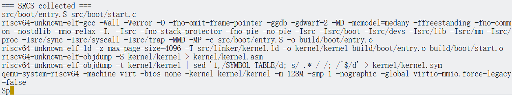
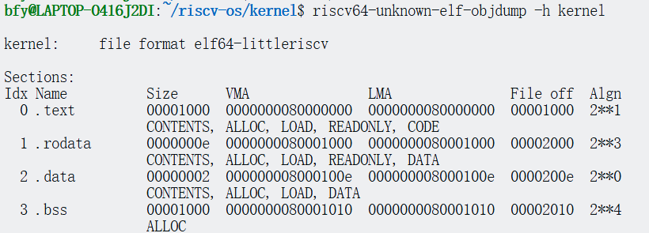
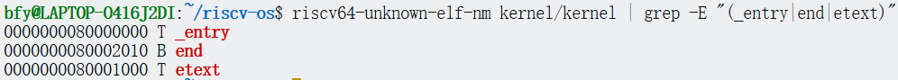
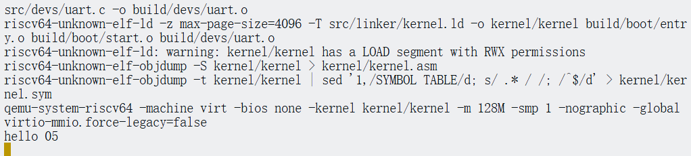

<!-- 实验报告头部（新增） -->
# Lab1 实验报告

## 实验目标
通过参考 xv6 的启动机制，理解并实现最小操作系统的引导过程，最终在 QEMU 中输出 "Hello 05"。

## 实验环境
- 主机操作系统：Linux
- 模拟器：qemu-system-riscv64
- 交叉工具链：riscv64-unknown-elf-

## 实验原理概述
- RISC-V virt 机器上，-kernel 会把镜像加载到 0x80000000 并从该地址开始执行。
- 启动流程：设置栈指针 → 清零 BSS → 跳转到 C 入口 → 初始化 UART → 打印字符串。
- UART 输出需轮询 LSR 的 THRE 位，空则向 THR 写入字符。

## 实验步骤

### 任务1

#### 1. 启动相关问题

**Q: 为什么第一条指令是设置栈指针？**  
A: 后续要用到的代码段、数据段等均依赖内存空间来存储。在跳转到C代码前，必须初始化栈空间。同时，也为每个CPU分配独立的4KB栈，避免多核竞争，保证安全。

**Q: la sp, stack0 中的stack0在哪里定义？**  
A: 在 start.c 中定义
```c
// start.c
char stack0[4096 * NCPU];  // NCPU为CPU核心数
```

**Q: 为什么要清零BSS段？**  
A: 避免之前内存中残留有其他数据。

**Q: 如何从汇编跳转到C函数？**  
A: 使用 call 或 jal 指令跳转，如：
```asm
call main
```

#### 2. 链接与内存布局

**Q: ENTRY(_entry) 的作用是什么？**  
A: 指定程序的入口点为符号 _entry（即 entry.S中的 _entry 标签）。

**Q: 为什么代码段要放在0x80000000？**  
A:  
- 首先是考虑 QEMU 平台的约定：QEMU 的 -kernel 选项会将内核镜像加载到 0x80000000。硬件复位后，CPU 也是从 0x80000000 开始执行指令。  
- 其次是符合 RISC-V 内存布局：0x80000000 是典型的 DRAM 起始地址（避开低地址的 MMIO 和设备映射）。  
- 最后是考虑兼容性：这样与大多数 RISC-V 硬件和模拟器保持一致。

**Q: etext、edata、end 符号有什么用途？**  
A:  
- `etext`：代表程序代码段的结束地址。主要用途包括确定代码段的边界，以便进行内存保护或实现动态代码加载等功能。  
- `edata`：代表已初始化数据段的结束地址。可以用来清晰地区分已初始化数据和未初始化数据（即 BSS 段的起点）。  
- `end`：代表 BSS 段的结束地址。一个关键作用是用来标记堆内存区域的起始地址。

#### 3. 单核系统简化

**Q: xv6支持多核，你的单核系统可以如何简化？**  
A: 不需要给每个核心分配栈，只分配一个固定的栈。

**Q: xv6的内存管理很复杂，最小系统需要哪些部分？**  
A:  
1. 栈管理：为函数调用和局部变量提供空间（静态分配即可）。  
2. BSS 段清零：确保未初始化变量为 0。

---

### 任务2：设计最小启动流程

#### 1. 启动流程图

CPU从`0x80000000`执行`entry.S` → 设置栈指针 → 清零BSS → 跳转到`main()` → C代码初始化UART → 输出"Hello 05" → 死循环。

#### 2. 内存布局方案

- 代码部分（.text）：最开头是启动文件 entry.o 里的 _entry 函数，后面跟着其他所有代码。
- 只读数据（.rodata）：存放常量数据。
- 普通数据（.data）：存放初始化过的全局变量。
- 未初始化数据（.bss）：存放默认值为0的全局变量。

#### 3. 必需的硬件初始化步骤

初始化uart和对应的输出函数。

#### 4. 关键问题

**Q: 栈应该放在内存的哪个位置？需要多大？**  
A: 0x80000000 开始，每个 CPU 分配 4KB。

**Q: 是否需要清零 BSS 段？为什么？**  
A: 需要，确保未初始化变量为 0。

**Q: 最简单串口输出需要配置哪些寄存器？**  
A: 发送保持寄存器（THR）和线路状态寄存器（LSR）。

---

### 任务3：实现启动汇编代码

#### 启动代码

```asm
# entry.S
.section .text
.global _entry
_entry:
    # 调试代码 
    li t0, 0x10000000    # UART 基地址 
    li t1, 'S'           # 启动标记 
    sb t1, 0(t0)         # 输出字符 S 表示启动 

    la sp, stack0 + 4096  # 单核直接设置栈

    # 设置栈后再输出一个字符验证 
    li t1, 'p'            # 栈设置完成标记 
    sb t1, 0(t0) 

    la a0, bss_top        # bss清零
    la a1, end
bss_loop:
    sw zero, (a0)
    addi a0, a0, 4
    blt a0, a1, bss_loop

    call start            # 跳转到 C 代码
spin:
    j spin
```

#### 启动代码调试检查效果图



---

### 任务4：编写链接脚本

#### 内存布局检查效果




---

### 任务5：实现串口驱动

#### 1. 输出一个字符的完整流程

CPU检查LSR寄存器看UART是否就绪，检测到就绪后将要输出的字符写入THR寄存器，硬件自动发送字符信息，将字符转换为串行信号，通过物理引脚输出。

#### 2. 为什么需要检查LSR的THRE位？

THR通常只能缓存1个字符，直接写入THR而不检查状态会导致数据丢失，THRE位为1时就表示THR为空，可以写入新字符。

#### 3. 具体实现

```c
#include "defs.h"

void uart_putc(char c) {
    volatile char *uart = (volatile char *)0x10000000; // volatile的作用是阻止优化，强制每次访问都从内存读取/写入
    while ((uart[5] & 0x20) == 0); // 等待 UART 就绪
    uart[0] = c;
}

void uart_puts(char *s) {
    while (*s != '\0') {  // 遍历字符串直到遇到结束符 '\0'
        uart_putc(*s);    // 输出当前字符
        s++;              // 移动到下一个字符
    }
}
```

---

### 任务6：完成C主函数

#### 1. 设计考虑

- 程序结束应该死循环：对于内核，通常不“退出”，而是进入空闲循环，避免 CPU 执行未定义代码
- 如何防止程序意外退出导致系统重启：用 while (1)避免意外退出，同时在start函数调用后加入死循环汇编代码做双重保险。

#### 2. 实际代码

```c
#include "defs.h"

__attribute__ ((aligned (16))) char stack0[4096 * 1];

void start() {
    uart_puts("hello 05\n");  // 输出 'hello 05' 表示进入 C 代码

    while (1);       // 死循环
}
```

#### 3. 效果展示


---

### 思考题

#### 1. 启动栈的设计

- 如何确定栈的大小？考虑哪些因素：综合考虑内存布局、函数调用需求和安全性确定。考虑函数调用深度，中断上下文保存，局部变量大小，调试需求，是否有多任务支持。
- 如果栈溢出会发生什么？如何检测栈溢出：栈溢出会导致导致相邻内存区域的数据被破坏，引发不可预测的系统行为。检测栈溢出最简单的办法是在栈底放置一个特殊的哨兵值（比如0xDEADBEEF），并定期检查这个值是否被修改。更高级的系统会使用内存管理单元（MMU）将栈边界外的内存页面设置为不可访问，这样一旦发生溢出就会立即触发硬件异常。

#### 2. BSS 段清零

- 写一个全局变量，不清零BSS会有什么现象：全局变量值为随机数，可能导致错误。
- 哪些情况下可以省略BSS清零：硬件或引导程序自动清零，程序不依赖BSS段初始化为零，动态分配替代全局变量。

#### 3. 与xv6的对比

- 你的实现比xv6简化了哪些部分：简化了入口汇编代码中对多个CPU核心的栈空间分配。
- 这些简化在什么情况下会成为问题：需要支持多个CPU时。

#### 4. 错误处理

- 如果UART初始化失败，系统应该如何处理：进入死循环。
- 如何设计一个最小的错误显示机制：在 uart_putc 发送数据前后，检测 UART 状态寄存器。如果长时间未就绪或写入失败，则认为出错。当检测到错误时，可通过硬件方式（如 LED、蜂鸣器等硬件）提示，但在最小机制下可仅用死循环来表示

## 实验小结
通过参考 xv6 的引导机制，完成最小内核从 entry 到 C 初始化再到 UART 输出的闭环，掌握了链接脚本、BSS 清零与串口轮询发送等关键要点。
