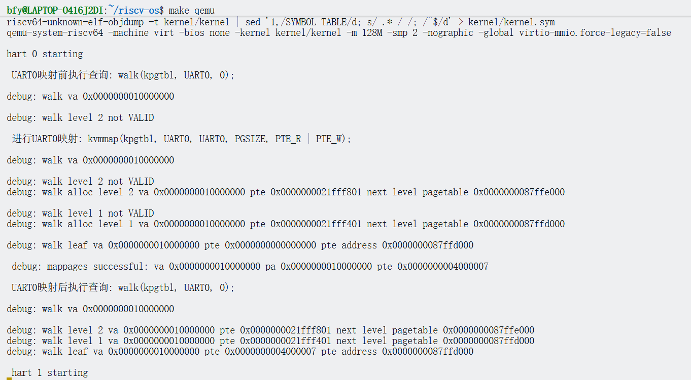
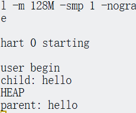
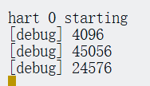
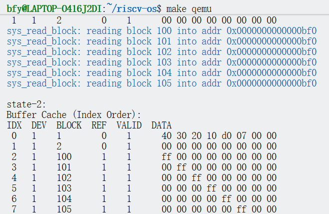
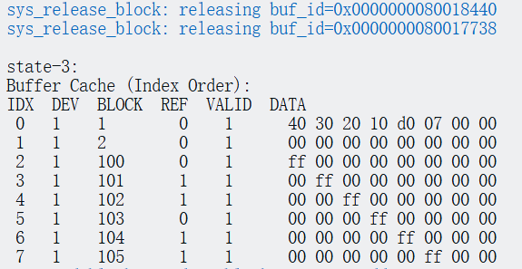
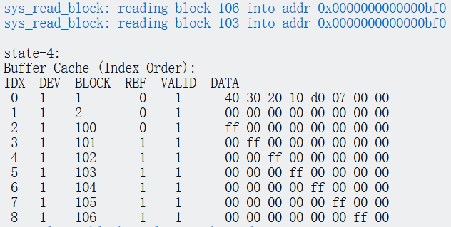
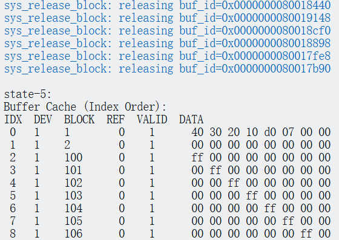
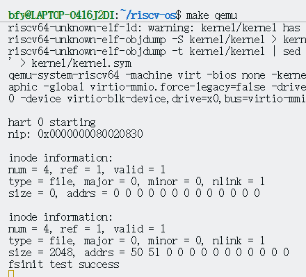
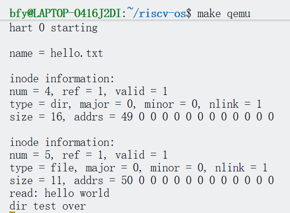

# Lab7 文件系统实验报告

## 实验目标
通过深入分析 xv6 的文件系统机制，理解文件系统从磁盘布局、inode 管理、块缓存、日志系统到目录解析的完整实现链条，并设计一个支持崩溃恢复与并发访问的健壮文件系统。

## 核心学习资料
1. 理论基础：
   - 《操作系统概念》第 13-14 章（文件系统接口与实现）
   - xv6 手册第 8 章（文件系统）
2. 源码分析重点：
   - `kernel/fs.h`：磁盘布局、超级块、inode 结构定义。
   - `kernel/fs.c`：inode 分配、块映射 (`bmap`)、目录操作 (`dirlookup`)。
   - `kernel/bio.c`：块缓存 (`bread`, `bwrite`) 与 LRU 替换。
   - `kernel/log.c`：日志系统与事务提交。
   - `kernel/sysfile.c`：文件系统调用接口。

## 实验结果
### 1.balloc与bfree


用于测试的系统调用：
```c

uint64 sys_alloc_block(void) {
    begin_op();
    
    // 使用根目录而不是当前目录
    struct inode *root = namei("/");
    if(root == 0) {
        end_op();
        return -1;
    }
    
    ilock(root);  // 加锁
    
    uint bn = balloc(root->dev);
    printf(COLOR_GREEN "sys_alloc_block: allocated block %d\n" COLOR_RESET, bn);
    
    iunlockput(root);
    end_op();
    return bn;
}

// 释放一个数据块
uint64 sys_free_block(void) {
    uint bn;
    
    // 检查参数
    argint(0, (int*)&bn) ;
    
    printf(COLOR_GREEN "sys_free_block: freeing block %d\n" COLOR_RESET , bn);
    
    begin_op();
    
    // 使用根目录
    struct inode *root = namei("/");
    if(root == 0) {
        printf(COLOR_RED "sys_free_block: root not found\n" COLOR_RESET);
        end_op();
        return -1;
    }
    
    // 锁定根目录
    ilock(root);
    
    // 释放块
    bfree(root->dev, bn);
    
    // 解锁
    iunlockput(root);
    
    end_op();
    
    return 0;
}

```

测试代码：
```c
int main()
{

        uint64 block_num_1 = syscall(SYS_alloc_block);
        uint64 block_num_2 = syscall(SYS_alloc_block);
        uint64 block_num_3 = syscall(SYS_alloc_block);


        syscall(SYS_free_block, block_num_2);
        syscall(SYS_free_block, block_num_1);
        syscall(SYS_free_block, block_num_3);
        
        while(1);
        return 0;

}
```

### 2.

耗尽buf测试



运行结果显示，从 state-1 到 state-5 的所有测试阶段均已通过，且输出符合预期：

State-1: 初始状态。



State-2: 申请并写入了 6 个 buffer (block 100-105)。



State-3: 释放了 buffer 0 (block 100) 和 3 (block 103)。



State-4: 重新申请了 block 106 和 103。可以看到 block 103 复用了之前的 buffer（LRU 机制生效）。



State-5: 释放所有 buffer，引用计数归零。



3. inode写入



数据一致性测试通过：fsinit test success表明写入和读取的数据完全一致

文件系统功能正常：

成功创建了inode（编号4）

写操作正确执行（两次writei）

读操作正确执行（readi读取全部数据）

磁盘块分配正常：初始时addrs全为0,写入后分配了块50和51，符合预期

文件大小更新正确：size从0变为2048（2 * BSIZE，假设BSIZE=1024）


4. 路径


从输出日志中可以看到：

成功创建了目录结构和文件 /user/work/hello.txt。

成功写入了 "hello world"。

成功通过 namei 找到文件并读取了内容


## 任务列表与问题解答

### 任务1：理解 xv6 文件系统布局

#### 磁盘布局结构分析
xv6 文件系统将磁盘划分为以下连续区域：
```text
| boot | super | log | inode blocks | bitmap | data blocks |
| 0    | 1     | 2-? | ?-?          | ?      | ?-end       |
```
1. **各区域作用**：
   - **boot (Block 0)**：引导块，存放引导加载程序（Bootloader），系统启动时由 BIOS 加载。
   - **super (Block 1)**：超级块，存放文件系统的元数据（大小、各区偏移量、魔数）。
   - **log**：日志区，用于实现写前日志（WAL），保证崩溃一致性。
   - **inode blocks**：inode 表，连续存储所有文件的元数据（`struct dinode`）。
   - **bitmap**：位图区，每一位对应一个数据块的占用状态（0 空闲，1 占用）。
   - **data blocks**：数据区，存放文件内容与目录项。

2. **为什么要这样组织？**
   - **简单性**：静态分区使得定位各区域非常容易（只需读取超级块）。
   - **效率**：inode 集中存放利用了局部性；位图集中存放便于快速查找空闲块。

3. **各区域大小如何确定？**
   - `mkfs` 工具在创建文件系统时根据用户指定的文件系统总大小（`FSSIZE`）和 inode 数量（`NINODES`）计算得出。超级块中记录了这些计算后的偏移量。

#### 超级块 (Superblock)
```c
struct superblock {
  uint magic;        // 魔数，用于识别文件系统类型
  uint size;         // 总块数
  uint nblocks;      // 数据块数量
  uint ninodes;      // inode 数量
  uint nlog;         // 日志区大小
  uint logstart;     // 日志区起始块号
  uint inodestart;   // inode 区起始块号
  uint bmpstart;     // 位图区起始块号
};
```
- **为什么需要元数据？** 操作系统挂载文件系统时，必须知道从哪里读取 inode、哪里分配数据块。超级块是文件系统的“自描述”信息。
- **一致性保证**：超级块通常只在格式化时写入，运行时只读（除非支持在线扩容）。若超级块损坏，文件系统将无法挂载，因此现代 FS 会在多个位置备份超级块。

#### Inode 结构
```c
struct dinode {
  short type;            // 文件类型 (FILE, DIR, DEVICE)
  short major, minor;    // 设备号 (仅 DEVICE 类型有效)
  short nlink;           // 硬链接计数
  uint size;             // 文件大小 (字节)
  uint addrs[NDIRECT+1]; // 数据块地址映射
};
```
- **直接块与间接块**：
  - `addrs[0..NDIRECT-1]` 直接指向数据块，访问快。
  - `addrs[NDIRECT]` 指向一个间接块，该块内部存储更多数据块号。
- **支持大文件**：通过多级间接块（xv6 仅一级，最大 12+256 块；现代 FS 用二级/三级或 Extent 树）。
- **硬链接**：多个目录项指向同一个 inode 号，`nlink` 记录有多少个目录项指向它。删除文件时仅 `unlink` 目录项并减 `nlink`，当 `nlink==0` 且无进程打开时才真正释放 inode 和数据块。

### 任务2：分析 xv6 的 inode 管理机制

#### Inode 缓存 (icache)
内存中的 `struct inode` 是磁盘 `struct dinode` 的缓存与扩展：
- **关系**：内存 inode 包含磁盘 inode 的所有字段，外加运行时状态（`ref`, `lock`, `valid`）。
- **引用计数 (`ref`)**：记录有多少个指针（内存中）指向该 inode（如打开的文件描述符、当前工作目录）。`ref > 0` 时 inode 即使 `nlink == 0` 也不会被回收。
- **缓存一致性**：通过 `ilock` 保证同一时间只有一个进程能修改 inode 内容；通过 `valid` 标志保证从磁盘读取最新数据。

#### Inode 分配 (`ialloc`)
1. **查找空闲**：遍历 inode 区域（通常不使用位图，而是扫描 `type == 0` 的 inode）。
2. **初始化**：设置 `type`，清空内容，`nlink = 1`。
3. **持久化**：必须通过日志系统写入磁盘，确保分配操作原子性。
4. **并发**：`ialloc` 需要锁保护（通常是全局锁或分段锁）以防两个进程分配到同一个 inode。

#### 数据块映射 (`bmap`)
- **逻辑转物理**：
  - 若 `bn < NDIRECT`，直接返回 `addrs[bn]`。
  - 若 `bn >= NDIRECT`，先读取 `addrs[NDIRECT]` 指向的间接块，再从间接块中读取第 `bn - NDIRECT` 项。
- **扩展文件**：若 `bmap` 发现对应位置为 0（未分配），则调用 `balloc` 分配新块并更新 inode/间接块。

**关键问题：**
- **替换策略**：xv6 的 `icache` 是固定大小数组，采用简单的引用计数法。若 `ref == 0` 则该槽位可被回收重用（LRU 策略可选）。
- **防止泄漏**：确保所有分配路径在错误时回滚；`fsck` 工具可离线检查 `nlink` 与实际目录引用是否匹配。
- **大文件性能**：间接块需要额外的 I/O。现代 FS 使用 **Extent**（起始块+长度）减少元数据开销，或使用 **B+树** 索引。

### 任务3：设计你的文件系统布局

#### 设计方案
```c
#define BLOCK_SIZE        4096
#define SUPERBLOCK_NUM    1
#define LOG_START         2
#define LOG_SIZE          30

struct my_inode {
    uint16_t mode;        // 权限与类型 (rwx, type)
    uint16_t uid;         // 用户 ID
    uint32_t size;        // 大小
    uint32_t blocks;      // 占用块数 (含间接块)
    uint32_t atime, mtime, ctime; // 时间戳
    uint32_t direct[12];  // 12 个直接块
    uint32_t indirect;    // 一级间接
    uint32_t double_indirect; // 二级间接 (支持更大文件)
};
```
1. **平衡小/大文件**：直接块保证小文件（< 48KB）只需一次 I/O；多级间接块支持 GB 级大文件。
2. **扩展属性**：可在 inode 中预留字段，或使用独立的 xattr 块。
3. **目录性能**：线性搜索目录项在大目录下极慢。优化方案：目录项中使用哈希表或 B+ 树组织文件名。
4. **符号链接**：一种特殊类型的文件，其数据块存储目标路径字符串。

### 任务4：实现块缓存系统

#### 缓存结构 (`struct buf`)
- **双向链表**：用于维护 LRU（最近最少使用）顺序。
- **哈希表**（可选）：用于快速根据 `(dev, blockno)` 查找缓存块，避免遍历整个链表。
- **状态位**：`valid` (数据有效), `dirty` (需写回)。
- **锁**：`sleeplock` 允许在 I/O 期间睡眠，不占用 CPU。

#### 缓存管理 (`bread`, `bwrite`, `brelse`)
- `bread`：查缓存 -> 命中则返回；未命中则分配新 buf -> 读磁盘 -> 返回。
- `bwrite`：标记 `dirty`，调用磁盘驱动写出（通常通过日志层）。
- `brelse`：引用计数减 1；若为 0，将 buf 移至 LRU 链表头部（或尾部，视实现而定），供后续回收。

**实现挑战：**
- **缓存大小**：太大浪费内存，太小频繁 I/O。通常动态调整或设为物理内存的一定比例。
- **写回策略**：
  - **Write-Through**：立即写回（安全但慢）。
  - **Write-Back**：延迟写回（快但崩溃易丢数据）。xv6 利用日志系统实现定期的原子写回。
- **预读 (Readahead)**：检测到顺序读模式时，提前发出后续块的 I/O 请求。

### 任务5：实现日志系统

#### 日志原理 (WAL)
- **原子性**：文件系统操作（如 `create`）涉及多个块的修改（inode, 目录, 位图）。若中途断电，FS 会处于不一致状态。
- **机制**：所有写操作先写入磁盘上的日志区；只有日志完整写入后，才将数据“安装”到实际位置。
- **恢复**：重启时检查日志区，若有已提交但未安装的事务，重放它们。

#### 事务流程
1. `begin_op()`：声明事务开始，增加 `outstanding` 计数。若日志空间不足，睡眠等待。
2. `log_write(b)`：不直接写盘，而是将块固定在内存缓存中，标记为“属于当前事务”。
3. `end_op()`：减少计数。若计数为 0（当前无并发事务），触发 `commit()`。
   - **Commit 流程**：
     1. **Write Log**：将所有脏块写入磁盘日志区。
     2. **Write Head**：写入日志头（记录块数），这是**提交点**。
     3. **Install**：将日志区的数据拷贝到实际文件系统位置。
     4. **Clean Head**：清空日志头，完成。

**设计考虑：**
- **日志大小**：限制了单次事务能修改的最大块数。若事务过大（如大文件截断），需拆分事务。
- **组提交 (Group Commit)**：将多个并发的小事务合并为一个大日志提交，减少同步写日志头的开销。

### 任务6：实现目录和路径解析

#### 目录机制
- **目录项 (`struct dirent`)**：包含 `inum` 和 `name`。`inum=0` 表示该项已删除。
- **路径解析 (`namex`)**：
  - 从根目录（`/`）或当前目录开始。
  - 逐层解析：`skipelem` 提取一级文件名 -> `dirlookup` 找 inode -> `ilock` -> 检查是否为目录 -> 循环。
  - 处理 `.` 和 `..`。

#### 实现挑战
- **并发查找**：路径解析涉及大量锁操作（目录锁、inode 锁）。需注意锁顺序（通常自顶向下）以防死锁。
- **长文件名**：xv6 限制 14 字节。支持长文件名需变长目录项记录（如 Ext2/3/4），结构更复杂。
- **硬链接/软链接**：
  - 硬链接：禁止对目录创建硬链接（防环）。
  - 软链接：解析时需检测并递归解析（需限制递归深度防死循环）。

### 测试与调试策略

#### 完整性测试
- 验证 `open`, `write`, `close`, `read` 流程的数据一致性。
- 验证 `unlink` 后文件不可见且空间被回收。

#### 并发与崩溃测试
- **并发**：多进程同时创建/删除同一目录下的文件，检测是否出现重名、inode 泄漏或死锁。
- **崩溃模拟**：在 `commit` 的不同阶段（写日志前、写头后、安装中）强制重启，验证 `recover_log` 能否正确恢复一致性。

#### 调试建议
- **状态检查**：打印超级块空闲计数、缓存命中率、日志提交状态。
- **Inode 追踪**：在 `ialloc`/`iput` 时打印日志，跟踪 inode 引用变化。

### 思考题与回答

1. **设计权衡**
   - **xv6 优缺点**：优点是极其简单，代码量小，易于教学；缺点是性能低（线性目录搜索、无细粒度锁、同步写日志）、不支持大文件、无故障恢复能力（除日志外）。
   - **平衡**：在简单结构上引入关键优化（如日志、Extent、B+树目录）是现代 FS 的演进之路。

2. **一致性保证**
   - **日志原子性**：依赖于磁盘扇区写入的原子性。只要“日志头”这个扇区成功写入，整个事务就被视为提交。
   - **恢复中崩溃**：日志恢复操作是**幂等**的（Idempotent）。重放一次和重放十次效果相同（都是把数据覆盖到目标位置），因此恢复过程中崩溃只需重启再次恢复即可。

3. **性能优化**
   - **瓶颈**：磁盘 I/O 延迟、目录查找（CPU/IO）、大锁竞争。
   - **改进目录**：使用哈希表或 B+ 树索引目录项；目录项缓存 (dentry cache)。

4. **可扩展性**
   - **支持大文件**：多级间接块、Extent 树。
   - **大文件系统**：64 位块号、动态 inode 分配（不预留固定区域）、块组（Block Groups）分散元数据。

5. **可靠性**
   - **检测修复**：`fsck` (File System Check) 工具扫描元数据一致性（引用计数、位图、目录树结构）。
   - **在线检查**：后台 Scrubbing 线程定期读取校验和（Checksum），如 ZFS/Btrfs。

## 实验总结
本实验从底层的磁盘布局出发，构建了 inode 管理、块缓存、日志事务和目录解析四大支柱。理解了“缓存+日志”如何同时解决性能与一致性问题，以及 inode 间接索引如何灵活支持文件增长。通过实现一个类 Unix 文件系统，掌握了操作系统管理持久化数据的核心逻辑。
