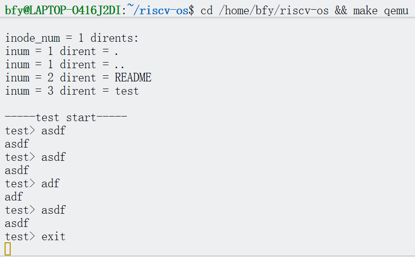

# 实验目标
本实验以“用户态程序无法 `exec` 并触发内核异常”为驱动，完成 `exec` 系统调用的补齐与调试闭环。目标包括：在内核侧建立正确的系统调用分发与参数取值路径，在用户态侧形成可验证的启动链路，并通过文件系统镜像命名规则与 console 输入链路的实证分析，最终实现从 `initcode` 到目标用户程序的稳定 `exec`。


# 代码仓库
https://github.com/bai-feng-yu/riscv-os/Lab-8

# 实验环境与运行方式
实验运行于 Linux 环境，使用 `qemu-system-riscv64` 的 `virt` 机器模型启动内核，并通过串口控制台进行交互。构建与运行命令如下。

```sh
make qemu
```

QEMU 运行于 `-nographic` 模式时，退出方式为 `Ctrl-A` 后按 `X`。

# 结果展示
## 结果截图

最终系统能够正常启动并完成文件系统初始化。随后 `initcode` fork 子进程并执行 `exec("/test")`，进入用户程序后出现交互提示符。用户键入一行文本后能够被用户态 `read` 读到并回显，直接按回车可触发测试程序退出，父进程 `wait()` 返回后输出结束提示。典型输出如下。


## 测试代码
```c
#include "userlib.h"

int main(int argc, char* argv[])
{
    char tmp[128];
    while(1) {
        memset(tmp, 0, 128);
        stdout("test> ", 6);
        int n = (int)stdin(tmp, 127);
        if(n <= 0)
            return 0;
        tmp[127] = 0;
        // 直接按回车（或 CRLF）也退出
        if((n == 1 && tmp[0] == '\n') || (n == 1 && tmp[0] == '\r') ||
           (n == 2 && tmp[0] == '\r' && tmp[1] == '\n'))
            return 0;
        if(strncmp(tmp, "exit", 4) == 0)
            return 0;
        stdout(tmp, (uint32)n);
    }
}
```

# 理论基础与实现过程
RISC-V 用户态进入内核主要依赖 `ecall` 指令。用户态约定将系统调用号放入 `a7`，参数放入 `a0` 至 `a5`。陷入内核后，硬件保存少量现场并跳转到 trap 入口；内核将其余寄存器保存到进程的 `trapframe`，随后由 `syscall()` 根据 `a7` 分发到具体的 `sys_*` 实现。

在这一模型下，`exec` 的正确性依赖三条链路：系统调用分发表必须包含 `SYS_exec`，内核必须能从用户态安全地取出 `path` 与 `argv`，并将返回值写回 `trapframe->a0`；同时用户态可执行文件必须在镜像中存在且命名一致，并且用户态程序必须具备正确入口 `_start` 才能在 `exec` 之后正常运行。

# 问题现象与关键发现
实验初期执行 `make qemu` 后出现内核异常，表现为 `kerneltrap` 且 `scause=0x0f`，`stval` 指向一个很小的虚拟地址。该异常含义为 Store/AMO page fault，通常意味着内核态写入了一个无效指针所指向的地址。

通过将 `sepc` 对应的地址定位到反汇编代码，发现故障点发生在 `syscall()` 返回路径中对 `trapframe->a0` 的写回操作，触发写入地址类似 `0x70` 的场景。这一数值与 `trapframe` 内 `a0` 成员的偏移吻合，说明当时用于写回的 `trapframe` 指针已经失效或为 NULL，导致写入落在低地址。

该发现直接指向一个根因：`syscall()` 在调用具体 `sys_*` 函数后，继续依赖某个寄存器或临时变量仍保持为 trapframe 指针，而实际在函数调用过程中该寄存器内容不再可靠。修复应当将返回值写回逻辑与进程对象重新绑定，避免对调用前寄存器状态的隐式假设。

## 修复一：系统调用返回值写回的可靠性
针对上述异常，在 [src/syscall/syscall.c](src/syscall/syscall.c) 中调整了 `syscall()` 的返回值写回方式：先保存系统调用返回值，再重新获取当前进程指针并检查其 `trapframe` 有效性，最后写回 `p->tf->a0`。该修改消除了对寄存器保存关系的隐式依赖，使写回逻辑与内核进程对象的生命周期一致。


## 修复二：补齐 `SYS_exec` 分发与内核实现
在消除 panic 后，系统进入下一阶段故障：出现 `unknown sys call 24`。结合用户态头文件中的系统调用号定义，可以确认 `24` 对应 `exec`，该错误说明内核分发表缺失相应入口。

为此在 [src/syscall/syscall.c](src/syscall/syscall.c) 中将 `SYS_exec` 注册到分发表，并在 [src/syscall/exec.c](src/syscall/exec.c) 中补齐 `sys_exec()`：
实现遵循内核参数访问规范，使用 `argstr` 获取用户传入的路径字符串，使用 `argaddr` 获取 argv 指针数组地址，并逐项从用户空间拷贝指针与字符串，构造内核侧参数后调用 `kexec()` 完成地址空间切换。对应声明补充在 [src/syscall-h/sysfunc.h](src/syscall-h/sysfunc.h)。

这一阶段的理论要点在于用户空间与内核空间的边界：内核不可直接信任用户指针，必须通过拷贝与长度限制保证内核内存安全；同时 `exec` 的本质是以新程序替换当前进程的用户态映射，但保留进程标识与部分内核态资源。


## 修复三：标准输入输出与可观测性建设
虽然 `exec` 系统调用已存在，但在调试过程中发现“看似卡住或无输出”的现象。这类现象往往来自两个方向：一是 `init` 进程未正确预置 `fd 0/1/2`，导致用户态打印不可见；二是用户态 syscall 封装与内核端参数顺序不一致。

本实验采取最小代价保证可观测性，在 [src/proc/proc.c](src/proc/proc.c) 的 `userinit()` 相关路径为 init 进程预置 console 的 `ofile[0..2]`，使用户态 `write` 能输出到串口终端。同时在用户态库中统一 `STDIN=0`、`STDOUT=1` 的约定，并将 `sys_read/sys_write` 的参数顺序调整为与内核 `sys_read/sys_write` 的取参方式一致，确保 `read(fd, buf, n)` 与 `write(fd, buf, n)` 语义闭合。

该阶段强调理论与实践的对应关系：系统调用 ABI 不仅体现在寄存器传参，还体现在用户态封装函数对参数位置的封装顺序；只要两端对同一系统调用的参数序存在偏差，即使内核实现本身正确，也会表现为“无输入”“无输出”或随机错误。

## 关键发现：镜像中文件名与 `exec` 路径不一致
在 `exec` 仍失败时，实验引入了最直接的证据链：临时打印根目录目录项以确认镜像中实际文件名。通过在文件系统初始化后遍历根目录，得到根目录项包含 `README` 与 `test`，而非 `_test`。

这一结果与 `mkfs` 的命名规则一致：将用户程序写入镜像时会去除前导下划线。因此 `initcode` 中应当 `exec("/test")` 而不是 `exec("/_test")`。


## 关键修复：用户态入口 `_start` 缺失导致 `exec` 后程序异常
在进一步验证中出现链接器警告，提示用户程序缺少入口符号 `_start`。这会导致 `exec` 载入用户程序后无法按预期进入用户态入口，从而表现为异常退出或无后续输出。

根因在于用户程序的链接规则未将 [user/start.S](user/start.S) 编译并链接进各个用户程序。为保持一致性，在 [Makefile](Makefile) 中增加 user 目录的 `.S` 编译规则，并将 `start.o` 纳入用户态通用链接对象，使每个用户程序都具备统一入口。

该修复体现了 `exec` 的完整语义：内核负责载入 ELF 并设置用户态寄存器与 PC，但用户态程序必须满足 ABI 约束，入口符号与启动桩缺一不可。


## 关键修复：console 输入链路中断处理
用户输入“回车无法被识别”的现象并非换行符转换错误，而是输入根本未进入 console 行缓冲。进一步检查发现 [src/devs/uart.c](src/devs/uart.c) 的 `uartintr()` 曾被改为仅回显字符，未调用 `consoleintr(c)` 将字节写入 `cons.buf` 并触发 `wakeup`。在这一状态下，用户在终端看到字符被回显，但用户态 `read` 将永久阻塞。

恢复 `uartintr()` 的正确路径后，输入字节会被 `consoleintr` 转换并进入行缓冲，其中 `\r` 会被规范化为 `\n`，`consoleread()` 在读到换行后返回，使用户态能够识别“按回车提交一行”。


# 最终验证与行为说明
完成以上修复后，启动链路表现为：内核启动并完成文件系统初始化，`initcode` fork 子进程并执行 `exec("/test")`，进入 test 程序后能够打印提示符并接受终端输入。test 在读到换行后可按预期回显或退出，从而使 `initcode` 的 `wait()` 返回并输出结束提示。

需要注意的是，`init` 进程在完成一次验证后通常不应退出，否则会触发内核对 init 退出的保护逻辑，因此实验中保持 init 进程在完成 `wait` 后进入 sleep 循环属于合理行为。

# 实验总结
本实验以一次内核异常为入口，完成了 `exec` 系统调用从“分发缺失”到“参数拷贝与执行替换”再到“用户态入口、镜像命名、console 输入链路”的端到端闭环。实践表明，`exec` 的正确性不是单点函数的正确性，而是 ABI、文件系统、进程文件表、ELF 入口与中断驱动等多个模块协同一致的结果。通过将每一次现象都转化为可复现、可定位、可验证的证据链，本实验最终得到稳定且可交互的用户态程序执行效果。

